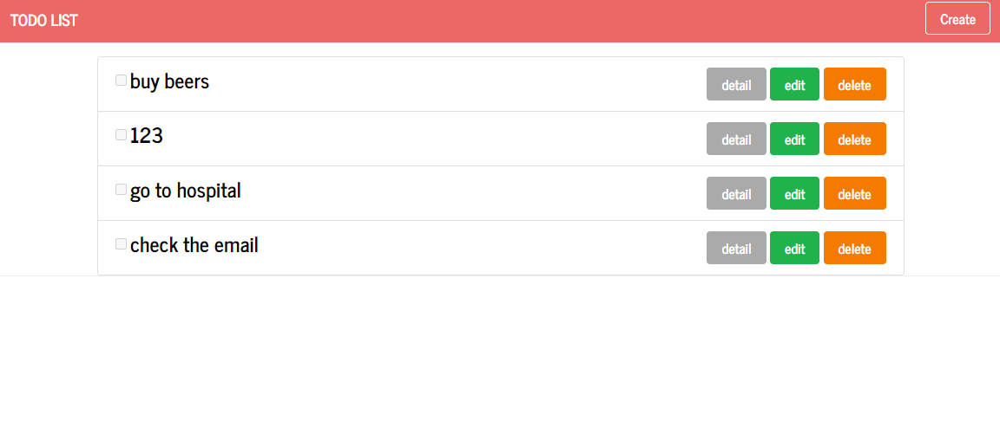

# Spending Tracker

- 打造 Todo
- 前端使用 BootStrap/Express-Handlebar/BootMatch
- 後端使用 Node.js/ Express/ MongoDB/ Heroku
- 作品連結：https://tranquil-sands-91676.herokuapp.com/

## 預覽圖



## 功能介紹

- CRUD

#### 使用者可以

- 瀏覽所有 Todo
- 新增一筆 Todo
- 編輯該筆 Todo
- 刪除該筆 Todo

## 安裝版本

- Express v4.17.1
- Express-Handlebars v5.3.4
- Method-Override v3.0.0
- Mongoose v5.13.13

## 安裝步驟

1. 打開終端機 (Terminal) 輸入以下訊息，下載專案至本機

```
git clone https://github.com/reDawsonLin/todolist-fullstack.git
```

2. 進入專案目錄資料夾

```
cd spending-tracker
```

3. 安裝 npm 套件

```
npm install
```

4. 加入種子資料

```
npm run seed
```

5. 啟動伺服器來執行專案

```
npm run dev
```

6. 出現以下訊息即可打開瀏覽器輸入 http://localhost:3000 開始使用

```
App is running on http://localhost:3000
```
